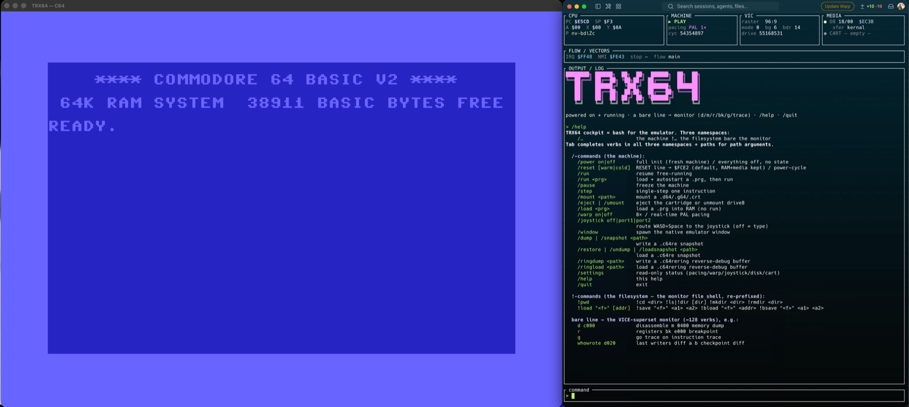
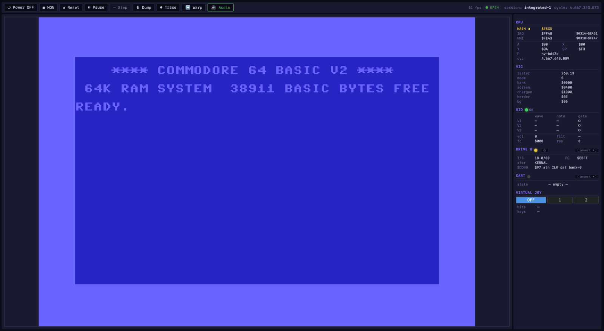

# TRX64

A headless, cycle-accurate Commodore 64 + 1541 runtime. Snapshot the machine, rewind it,
step backwards, and ask a live trace who wrote an address.

**One daemon, one API, N front ends.** Headless and API-first: every capability is a
JSON-RPC method, so a script or an LLM agent drives it as completely as a person does. One
machine per process, shared by every client connected to it.

Humans get front ends on top: **`trx64cli`**, a terminal cockpit with a native emulator
window that links the runtime in-process, and
**[C64RE](https://github.com/Jondalar/C64ReverseEngineeringMCP)**, a reverse-engineering
workbench in the browser that talks to the daemon over the socket. Same verbs either way.

It runs real scene software: multi-stage cracks, custom fastloaders, EasyFlash carts.



*`trx64cli` — terminal cockpit, native emulator window, standalone.*

C64RE is the sibling project: capability lives here, meaning and memory live there. Either
works without the other.



*The same machine through C64RE — live CPU, VIC, SID, drive and cart panels.*

---

## Install

Binaries for macOS, Linux and Windows (x86_64 + arm64):
**[Releases](https://github.com/Jondalar/TRX64/releases)** — each archive holds `trx64cli`
and `trx64-daemon`. C64 ROMs are not included; point at your own with `--rom-dir`.

```sh
brew install jondalar/tap/trx64
```

From source: `cargo build --release`. Builds natively on all three, MSVC included.

---

## Capabilities

- **Rewind** — play the machine backwards frame by frame, stop anywhere, run on. Each
  step restores registers, RAM, I/O and the drive.
- **Reverse stepping** — `rstep` undoes the last instructions, byte-exact. The ring is
  always on; nothing to arm.
- **`whowrote <addr>`** — PC, cycle, old → new.
- **JAM triage** — crash PC → wild jump → stack corruptor.
- **Observers** — watch an address for exec, read or write; condition, action.
  Indirect addressing included: `sta ($fb),y`, `lda ($f0,x)`, `jmp ($0314)`.
- **Traces** — CPU, drive, IEC and memory to a binary log; query as swimlanes, memory
  maps or data-flow taint.
- **Marks & sandboxes** — name a point, jump back to it, branch, discard.
- **Cartridges** — EasyFlash, Ocean, Magic Desk, GMOD2/3, MegaByter. Flash and EEPROM
  writes survive a reset and a snapshot round trip.
- **Disks** — `.d64` / `.g64`, 35 to 42 tracks. Drive-side GCR writes reach the host file.
- **Shared sessions** — one machine, several clients, human and agent at once.
- **Snapshots** — `.c64re` full machine, `.c64rering` the reverse-debug buffers.

---

## Standalone: the CLI cockpit

A complete emulator in one binary: terminal cockpit plus a native window.

```sh
trx64cli                      # cockpit
trx64cli --window             # cockpit + emulator window
trx64cli mon "d c000"         # one-shot, prints and exits
trx64cli disasm game.prg      # static disassembly, no machine, no ROMs
```

Three namespaces on one command line: `/` drives the machine, `!` the filesystem, and a
bare line goes to the monitor. Tab completes all three.

```
/power on · /reset · /run · /pause · /warp on · /mount game.d64 · /window
F9 ◀| one frame back   F10 ◀◀ play back   F11 ⏸/▶   F12 |▶ one frame forward
```

Details: [`crates/trx64-cli/README.md`](crates/trx64-cli/README.md).

---

## Monitor

A VICE superset, ~128 verbs, on every front end. Full reference: **[MONITOR.md](MONITOR.md)**;
`help` prints the live list.

| | |
|---|---|
| **Run** | `g [addr]` go · `z`/`n` step into/over · `until <addr>` · `ret` |
| **Memory** | `m`/`d`/`a` dump / disassemble / assemble · `>` write · `f` fill · `t` transfer · `h` hunt |
| **Bank lens** | `m io d000`, `m ram e000` — see what the CPU sees, or the RAM under it |
| **Breakpoints** | `bk` exec · `wa`/`ws` watch read/write · `obs` conditional observers |
| **CPU** | `r` registers · `chis` history · `bt` backtrace · `flow` IRQ/NMI focus |
| **Reverse** | `rstep` step back · `whowrote <addr>` · `chis` · `crash` triage |
| **Time** | `mark <name>` · `goto <name>` · `frame ±N` · `play back\|fwd` · `cadence` · `window <s>` |
| **State** | `dump`/`undump` `.c64re` · `ringdump`/`ringload` · `trace on\|off` |
| **Analysis** | `map` memory map · `taint` · `swimlane` · `diff <a> <b>` |
| **Drive** | `device drive8` then `r`/`m`/`d` — the 1541's own 6502 |

---

## Daemon & API

```sh
trx64-daemon --project <dir> --port 4312 [--stream]
```

JSON-RPC 2.0 over WebSocket. One machine per process, shared by every client.

```json
{ "jsonrpc": "2.0", "id": 1, "method": "session/create", "params": { "pal": true } }
```

A typical flow: `session/create` → `debug/run` → `monitor/exec` / `trace/*` / `vic/inspect`
→ `checkpoint/*` to scrub → `snapshot/dump` to persist.

`--stream` adds the per-frame driver: video, breakpoints, JAM auto-break, recorder.

For embedding, `trx64-ffi` exposes a typed uniffi library (Swift bindings) —
[`crates/trx64-ffi/API.md`](crates/trx64-ffi/API.md).

**Formats:** `.c64re` machine snapshot, `.c64rering` reverse-debug buffers, `.c64retrace`
trace log. VICE `.vsf` imports.

---

## What to expect

This is my (dkl / Jondalar) personal emulator I developed for my own needs when
reverse engineering C64 games. You might need different features or things -
and you are invited to contribute code. Use issues and PRs here on GitHub please.

I will not answer feature requests without code / structured requirements and I
am not able to give support.

---

## License

**GPL-3.0-or-later** — see [LICENSE](LICENSE). The emulation cores are a source-faithful
port of [VICE](https://vice-emu.sourceforge.io/) (GPL-2.0-or-later, used under "or later").
Credits in [THANKS.md](THANKS.md).

> At the request of Count Zero on behalf of the CSDb staff, any CSDb association has been
> removed. For TRX64 or C64RE, please reach out via GitHub.
