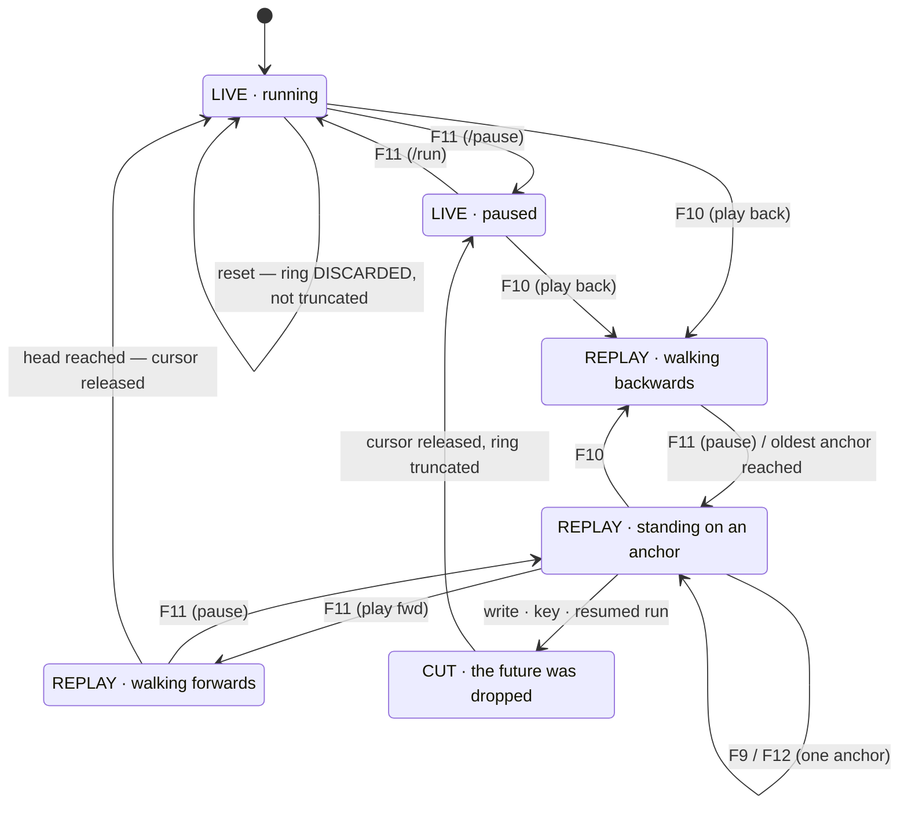

# Spec 808 — Rewind transport: play the machine backwards

**Status:** PROPOSED
**Repos:** TRX64 (daemon transport + monitor verbs + TUI keys) and C64RE (the ribbon in the
existing scrub UI). Feature parity is a requirement, not a nice-to-have — see §2.
**Number:** 808 (shared board `C64ReverseEngineeringMCP/specs/README.md`).
**Depends on:** 807 (a full checkpoint per frame has to be affordable first).
**Framing:** the owner's words, and the whole scope in one sentence — *"ich sehe einen Video
Clip, 10 Sekunden. Dann drücke ich Pause, dann sage ich: spiele das rückwärts ab. Und er
spielt 10 Sekunden rückwärts, jedes Bild in umgekehrter Reihenfolge."*

---

## §1 The measurement that decides the design

The obvious design is a **picture player**: cache the rendered frames, play them in reverse,
restore the machine only when the user stops. It is what every discussion of this reaches
for, and it is wrong here. Measured (`perf_bench bench_checkpoint_restore_step`, release,
K=7, 200 anchors walked backwards):

| | |
|---|---|
| One backward step = ring read + `restore_runtime_checkpoint` | **177 µs** |
| Share of one PAL frame | 0.89 % |
| At 50 steps/s (full-speed backward playback) | **0.9 % of wall-clock** |

**So backward playback does not need pictures. It moves the machine.** Each step really
restores RAM, the chips, the drive and the media, and everything that already looks at the
machine follows for free:

- the TUI's `/window` shows it, because it shows the machine (`window.rs`)
- the C64RE UI shows it, for the same reason
- registers, memory dumps, `chis`, screenshots — all correct at every frame
- "pause and inspect the state" stops being a feature: you are already there

No filmstrip cache. No second renderer. No parity work. **The parity exists because both
surfaces are looking at the same thing**, which is the only kind of parity that does not rot.

## §2 Feature parity is the constraint

> *"Da wir in TRX64 ein Multi-Client-Tool haben, sollte es wohl auf C64RE und TRX64 TUI
> gleichermaßen laufen — die GLEICHE Funktionalität muss da sein, feature parity."*

Not shared state — **shared capability**. Everything rewind can do exists as a monitor verb
and an RPC method; the UI ribbon and the TUI keys are two thin callers of the same surface.
No control that only one side has. This is doctrine rule 6 (API first, never UI without the
API underneath) applied to a transport.

The TUI is not the poor relation here: `/window` spawns a native emulator window
(`crates/trx64-cli/src/window.rs`), so it has a picture surface already.

## §3 Decisions (owner, 2026-08-13)

Each of these was a two-option question; what is recorded is the choice AND the reasoning,
so a later reader does not have to re-run the argument.

1. **The daemon drives the playback loop, not the client.** One implementation counts the
   frames and pushes position + state; both surfaces only display. The alternative — each
   client running its own loop over a `goto` primitive — means building the loop twice,
   testing the smoothing twice, and watching two timers drift.
2. **Every step is a real restore.** Falls out of §1. Stopping is therefore not a separate
   action: the machine is already at the frame you are looking at.
3. **One timeline.** Rewinding and then diverging truncates the future (`truncate_after`,
   already in the ring, keep-pinned). The branching model — *"ein Pause-Punkt, an dem ich
   verschiedene Zweige abgehen lassen kann mit unterschiedlichen Code-Overlays"* — is the
   owner's definition of a **Scenario** and gets **its own spec**, because branches need a
   view that shows them and blurring the two would ship a timeline nobody can see.
4. **Play runs the EMULATION from here.** ~~From frame 340 of 500, `play` walks 341…500
   through the existing anchors and only becomes live emulation at the end.~~
   **Reversed by the owner on 2026-08-13, after using it.** Pressing play after a rewind
   means "carry on from this moment"; a player that first re-shows the next four seconds
   is answering a question nobody asked. So `play` cuts the anchors ahead and the machine
   runs — visibly, with the count in the message ("dropped 8 anchor(s) ahead").

   Worth keeping on the record: he called the option we did NOT take the safer one at the
   time, for the reason in §5 — replaying and running look identical — and it turned out
   the safety was worth less than the directness. The reversal is a two-line change
   because both paths were already there.
5. **Transport keys are F9–F12, and pause moves.** The C64 keyboard has F1–F8 only
   (F2/F4/F6/F8 are SHIFT+F1/F3/F5/F7), so F9–F12 are the only function keys that cannot
   collide with the emulated machine — `window.rs:262` already states this rule. No
   modifiers: Shift+F-keys are swallowed by some terminals, and a control that silently does
   nothing on someone's setup is worse than a verb they have to type.

## §4 The surface

### Monitor verbs (the API both front-ends call)

```
play back [speed]     play backwards through the anchors
play fwd  [speed]     play forwards through the anchors, then go live
pause                 stop where you are (the machine IS there)
frame -N | +N         step N frames
goto <frame|cycle>    jump to an exact position
rewind                the whole picture: mode, position, window, anchors held
```

`speed` is optional and multiplies the step rate (1x default). At cadence 1 and 0.9 % of
wall-clock per step, 1x backwards is a genuine 50 fps.

### TUI keys

```
F9  ◀|   one frame back
F10 ◀◀   play backwards
F11 ⏸/▶  pause / play
F12 |▶   one frame forward
```

**F10 moves.** It is freeze/resume today, in both `tui.rs` and `window.rs` — and it is
documented in **no** `.md` in this repo (verified: zero matches outside code comments), so
moving it breaks no written promise. The new layout reads left-to-right as a transport, which
the old single-key freeze did not.

**The legend appears when the transport does.** On `pause` / F11 the TUI prints a transport
line and keeps it updated; while the machine is simply running free there is nothing to show
and nothing is shown. That is the ribbon's terminal equivalent — the keys are legible exactly
when they are usable, so nobody has to have learned them:

```
 REPLAY  ◀◀  frame 340/500   -3.2s   ▓▓▓▓▓▓▓▓▓▓▓░░░░░░░░░░░░░░░░░░░░
 F9 ◀|   F10 ◀◀   F11 ⏸/▶   F12 |▶        (`rewind` for the full picture)
```

### C64RE UI

A ribbon on the existing `ScrubTimeline` / `Filmstrip` components. Buttons call the verbs
above — no UI-only behaviour, no second implementation of the loop.

## §4a The state machine

Written down after four bugs in a row that were all the same bug: **the transport is a
state machine with two run-reasons, and it was implemented as a flag plus reflexes.**



**Two run-reasons, one pump.** The machine advancing and the transport stepping are
mutually exclusive activities driven by the same per-frame pump:

```
    pump ticks  ⟺  machine should advance  OR  transport should step
```

Getting that wrong is what produced the visible failures, and each looked like its own
bug until the diagram existed:

| Symptom | The state-machine hole |
|---|---|
| `play back` did nothing while paused | pump gated on `running` alone → the tick that steps the transport never fired |
| F11 did nothing at the head | mapped to one fixed verb; `play fwd` at the head has nothing to replay and never resumes the machine |
| F11 "paused" but the machine kept running | the key ran the transport `pause` (stop playback) instead of the cockpit `/pause` (stop machine) |
| after a reset, rewinding undid the reset | reset TRUNCATED the ring; it must DISCARD it — a reset replaces the machine, so every anchor describes one that is gone |

**F11 is therefore a decision, not a mapping** (`transport::f11_verb`), and it is a
**two-state toggle**: the question is "is anything moving?", where *moving* is the union
of both run-reasons. Reading them separately made F11 need three presses to get from
rewind-playing back to playing — the first cleared the host run flag, the second cleared
the transport, and only the third played. `StopEverything` clears both.

```
    moving = machine running  OR  transport playing

    moving  → stop both
    still   → go: `play fwd` when rewound, `/run` at the head
```

**And a forward step at the head runs the emulation.** Refusing it (there is no anchor
ahead) was the wrong answer: "one frame further" is a reasonable thing to ask for whether
or not a recording lies underneath, and it is what single-stepping a paused machine has
always meant. The per-frame capture then records that frame, so the ring grows by exactly
the frame you asked to see.

**Which frame you are shown — and why that is a choice.** An anchor carries no picture
(§4a dropped the two framebuffers: they cost 114 of every 167 µs), so landing on one
redraws it by running the emulation forward. Since an anchor lands wherever the raster
happened to be, the first frame drawn after it is usually cut in half — the top belongs
to the frame that was already half-drawn. So the transport drew **two** and kept the
second, which is whole.

That is a clean picture of the wrong frame, and it hides an entire class of thing. A
border opened for one frame, a raster split that fails for one frame, `$D020` painted
across the screen once — all of it lives in the frame that was discarded. Stepping back
onto the anchor showed the flash already over, which reads as *the ring never caught it*.
The ring caught it; the redraw threw it away.

- An anchor **on** a frame boundary draws one frame and keeps it: whole, and nothing
  lost. One comparison, and it is free.
- Otherwise the default is still the clean second frame, and `rawframe on` (RPC
  `transport/raw_frame`) keeps the first instead, seam and all. When you are chasing a
  raster bug the seam is not noise, it is the measurement.
- `transport/status` reports `shownFrame` either way, so nothing has to be inferred from
  what the picture looks like.

**And a reset is not a divergence.** Truncation is for *diverging* from a rewound
position — the anchors before the cursor stay valid. A reset, a power cycle or a media
swap replaces the machine, so the whole ring goes.

## §4b The rebuild: the daemon owns the state

The first implementation put run-state in the CLIENT and it produced a bug a round for a
whole afternoon. Written down because the rule is older than this spec and I built past
it: `TRX64/CLAUDE.md` already says the daemon "produces bytes, events and machine-state
and **owns** runtime, instrument, reverse-debug, trace, checkpoints", and
`docs/wl-trx64-play-api.md` already says "There is one live machine per container. Every
client connected to the…".

What was wrong: `trx64-cli/src/engine.rs` held `running: Arc<AtomicBool>` whose own
comment called it *"the AUTHORITY … distinct from the controller's `session.running`"* —
two truths about one fact — plus a reconciliation hack in the pump for when they drifted.
The pump loop lived in the client too, so the CLIENT set the frame cadence.

**Five symptoms, one seam:**

| symptom | the seam |
|---|---|
| F11 needed three presses to play | two run-flags, each press cleared one |
| header said PAUSE while cycles ran | client flag said paused, daemon was running |
| `play back` did nothing | pump gated on the client flag; the transport lives in the daemon |
| recording 4× too dense (2.5 s ring, not 10) | the client's 5 ms pump set the capture cadence |
| F10 still paused after pause moved | two key paths with no daemon state between them |

**The shape now.** One decision, in the one place that knows everything:

```
   session/tick { cycles }        <- clients hand over the real time that passed

     transport playing  ->  step an anchor (paced by the wall clock)
     session.running    ->  advance the emulation
     neither            ->  nothing

   session/play · session/pause · session/warp · transport/toggle
                                  <- events; the reply is the truth
```

`transport/toggle` is F11 **in the daemon**: if anything is playing, stop it; otherwise
resume forward. The client sends one event and renders one message — it no longer reads
two flags and issues two verbs.

The client keeps `quit` (its own lifecycle), `epoch` (an audio re-sync signal) and
`joystick_mode` (input routing, a UI concern). It keeps no machine state at all, and
`scripts/check-client-owns-no-state.sh` fails the build if any comes back — including on
the give-away phrasings ("AUTHORITY … distinct from", "reconcile the dual").

**Why this is load-bearing rather than tidy:** two front-ends exist and the owner requires
the same functionality in both. Parity is FREE when both render the same daemon state.
The moment a client owns something, parity becomes a thing somebody maintains by hand,
forever, and drifts the first time nobody looks.

**And it was only half done — BUG-048, 2026-08-15.** The client's flag went; the daemon
kept a second one. `play_intent` was what the tick and the transport read, while
`debug/run`, `debug/continue` and the `--stream` loop ran on `session.running`, and
`session/state` reported the OR of the two. The same seam, one layer down: a machine
started with `debug/run` and paused with F11 kept consuming cycles, and `runState` said
"running" for a machine nobody was advancing.

The comment on the field even declared the split deliberate — *"which must be false for a
manual tick to be legal"* — while the tick, three thousand lines away, adopted the flag
instead of refusing it. A rule stated in a doc comment and enforced nowhere is not a rule.

There is ONE flag now, `session.running`. The tick's adopt block is gone; with one flag
there is nothing to translate. The lesson generalises past this file: removing a duplicate
from the client does not make a fact single-sourced if the server still holds two copies of
it.

## §5 The mode indicator is load-bearing

Decision 4 has a real hazard, and it is the one thing in this spec that can quietly cost the
user something: **replaying forward and running live look identical** — the picture moves,
the machine advances. The moment they diverge is the moment the recording gets cut.

So the transport always states which of three modes it is in, on both surfaces — and in the
TUI it is the same line that carries the key legend (§4), so the mode is never somewhere the
user has to go looking for it:

```
REPLAY  ◀◀  frame 340/500   -3.2s      the anchors are intact
LIVE    ▶   frame 500/500    now       new anchors are being recorded
CUT     ▶   frame 341/500    now       the future was truncated here (-159 anchors)
```

`CUT` appears the instant an intervention truncates, and says how many anchors went. A
transport that changes what it is without saying so is the defect this section exists to
prevent.

## §6 What the owner flagged, kept on the record

On decision 4: *"ich denke B ist sicherer weil halt, aber lass uns mit A anfangen."*

**And then, having used it, he asked for B.** A (replay the anchors ahead, go live at the
head) shipped first; the moment it met a real session the answer was that play should
simply emulate from here. B is what runs now.

The note that was written here at the time said "if §5 turns out not to be enough in use,
B is a small change: the same code path with the truncation moved earlier." That held —
it was two lines. Which is the argument for writing down the option you did not take,
along with what it would cost to switch.

## §7 Gates

- **G1 — a backward step is exact.** Play back N frames from a known state, then forward N,
  and assert RAM, CPU, CIA, SID, VIC and the drive are byte-identical to where they started.
  Backwards must not be approximate; §1 only holds if the restore is total.
- **G2 — parity.** Every transport action is reachable as a monitor verb AND an RPC method,
  asserted by walking the verb table against the RPC table. No orphan on either side.
- **G3 — the keys are wired and documented.** F9–F12 dispatch, and the monitor help lists
  them. 807 shipped a verb that was tab-completable and absent from the help; the same class
  of defect is not repeated here.
- **G4 — the mode indicator cannot lie.** Assert `REPLAY` while playing over existing
  anchors, `LIVE` at the head, and `CUT` with the anchor count immediately after an
  intervention truncates.
- **G5 — cost, measured, in this file.** Re-run `bench_checkpoint_restore_step` after the
  transport lands and record the end-to-end per-step figure including the push to clients.
  The 177 µs above is the restore alone.
- **G6 — board.** `scripts/check-spec-board.sh` green.

## §7b Side effects a restore cannot undo

The picture regeneration (§4a) runs one or two frames of **real code** after each restore.
Real code writes things. Anything it writes that the anchor does not carry is a mutation the
re-restore cannot undo — so every scrub step would quietly change it.

- **Cart flash: fixed.** It rides every anchor now. It had to: a game that saves to its
  cart left the flash in the future while the CPU was restored into the past, and the
  regeneration frames could write it again on every step. Symptom: boot from CRT, pause,
  rewind, play, and the game no longer got past its intro. Affordable because the ring
  pools these blobs content-addressed — an unchanged flash across all 500 anchors is ONE
  copy, and only a real write adds another.
- **Disk (the mutable GCR overlay): still open.** It changes on every write, so
  content-addressing would not dedup it and a per-anchor copy is not affordable at this
  cadence. A disk-writing title has the same hole. Written down rather than pretended
  away; the fix is probably an undo-log of written sectors, not a copy of the image.
- **The host file underneath: still open, and older than this spec.** Rewinding does not
  un-write a `.d64`/`.g64` — the stream loop persists dirty tracks to the ORIGINAL file.
  Time travel has a side channel that does not travel.

## §8 Non-goals

- **Branching.** Its own spec (decision 3).
- **Reverse execution below a frame.** Instruction-level backwards is `rstep`, which exists
  and is a different mechanism (a CPU/RAM undo log — no chips, no drive). Nothing here
  changes it.
- **Deep history.** The ring is the short scrub window; the recorder owns long timelines.
