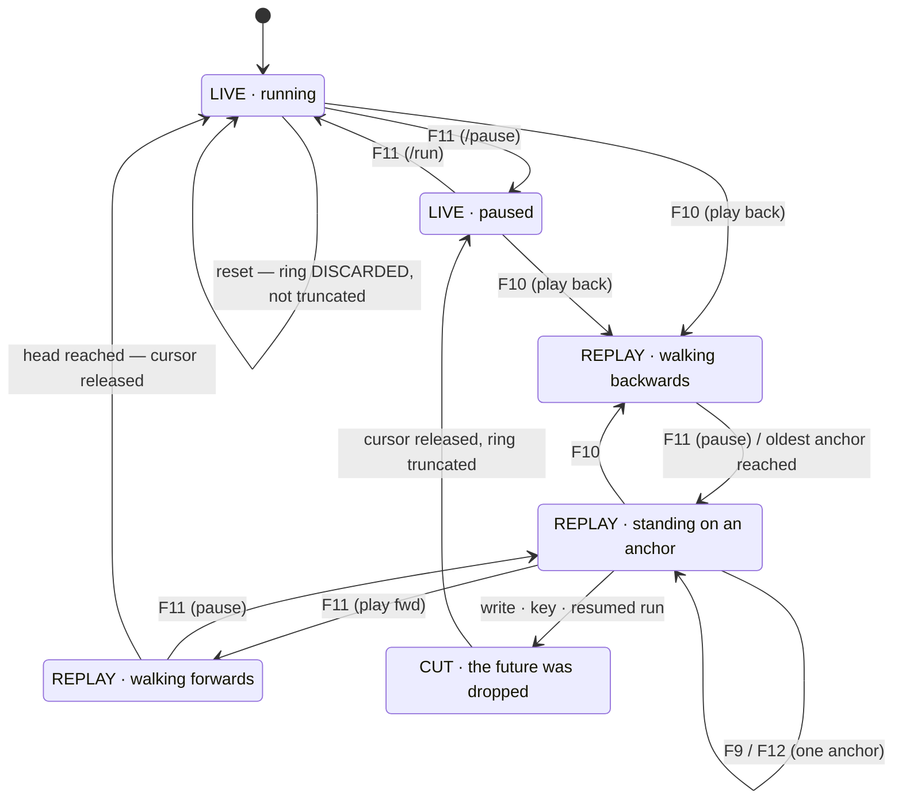

# Spec 808 — Rewind transport: play the machine backwards

**Status:** PROPOSED
**Repos:** TRX64 (daemon transport + monitor verbs + TUI keys) and C64RE (the ribbon in the
existing scrub UI). Feature parity is a requirement, not a nice-to-have — see §2.
**Number:** 808 (shared board `C64ReverseEngineeringMCP/specs/README.md`).
**Depends on:** 807 (a full checkpoint per frame has to be affordable first).
**Framing:** the owner's words, and the whole scope in one sentence — *"ich sehe einen Video
Clip, 10 Sekunden. Dann drücke ich Pause, dann sage ich: spiele das rückwärts ab. Und er
spielt 10 Sekunden rückwärts, jedes Bild in umgekehrter Reihenfolge."*

---

## §1 The measurement that decides the design

The obvious design is a **picture player**: cache the rendered frames, play them in reverse,
restore the machine only when the user stops. It is what every discussion of this reaches
for, and it is wrong here. Measured (`perf_bench bench_checkpoint_restore_step`, release,
K=7, 200 anchors walked backwards):

| | |
|---|---|
| One backward step = ring read + `restore_runtime_checkpoint` | **177 µs** |
| Share of one PAL frame | 0.89 % |
| At 50 steps/s (full-speed backward playback) | **0.9 % of wall-clock** |

**So backward playback does not need pictures. It moves the machine.** Each step really
restores RAM, the chips, the drive and the media, and everything that already looks at the
machine follows for free:

- the TUI's `/window` shows it, because it shows the machine (`window.rs`)
- the C64RE UI shows it, for the same reason
- registers, memory dumps, `chis`, screenshots — all correct at every frame
- "pause and inspect the state" stops being a feature: you are already there

No filmstrip cache. No second renderer. No parity work. **The parity exists because both
surfaces are looking at the same thing**, which is the only kind of parity that does not rot.

## §2 Feature parity is the constraint

> *"Da wir in TRX64 ein Multi-Client-Tool haben, sollte es wohl auf C64RE und TRX64 TUI
> gleichermaßen laufen — die GLEICHE Funktionalität muss da sein, feature parity."*

Not shared state — **shared capability**. Everything rewind can do exists as a monitor verb
and an RPC method; the UI ribbon and the TUI keys are two thin callers of the same surface.
No control that only one side has. This is doctrine rule 6 (API first, never UI without the
API underneath) applied to a transport.

The TUI is not the poor relation here: `/window` spawns a native emulator window
(`crates/trx64-cli/src/window.rs`), so it has a picture surface already.

## §3 Decisions (owner, 2026-08-13)

Each of these was a two-option question; what is recorded is the choice AND the reasoning,
so a later reader does not have to re-run the argument.

1. **The daemon drives the playback loop, not the client.** One implementation counts the
   frames and pushes position + state; both surfaces only display. The alternative — each
   client running its own loop over a `goto` primitive — means building the loop twice,
   testing the smoothing twice, and watching two timers drift.
2. **Every step is a real restore.** Falls out of §1. Stopping is therefore not a separate
   action: the machine is already at the frame you are looking at.
3. **One timeline.** Rewinding and then diverging truncates the future (`truncate_after`,
   already in the ring, keep-pinned). The branching model — *"ein Pause-Punkt, an dem ich
   verschiedene Zweige abgehen lassen kann mit unterschiedlichen Code-Overlays"* — is the
   owner's definition of a **Scenario** and gets **its own spec**, because branches need a
   view that shows them and blurring the two would ship a timeline nobody can see.
4. **Play-forward replays before it diverges.** From frame 340 of 500, `play` walks 341…500
   through the existing anchors and only becomes live emulation at the end. Watching never
   costs you your recording; truncation happens on real intervention (a key, the joystick,
   `wr`, a resumed run). The owner's own reservation is recorded in §6 — this is the less
   safe of the two options and it is chosen deliberately.
5. **Transport keys are F9–F12, and pause moves.** The C64 keyboard has F1–F8 only
   (F2/F4/F6/F8 are SHIFT+F1/F3/F5/F7), so F9–F12 are the only function keys that cannot
   collide with the emulated machine — `window.rs:262` already states this rule. No
   modifiers: Shift+F-keys are swallowed by some terminals, and a control that silently does
   nothing on someone's setup is worse than a verb they have to type.

## §4 The surface

### Monitor verbs (the API both front-ends call)

```
play back [speed]     play backwards through the anchors
play fwd  [speed]     play forwards through the anchors, then go live
pause                 stop where you are (the machine IS there)
frame -N | +N         step N frames
goto <frame|cycle>    jump to an exact position
rewind                the whole picture: mode, position, window, anchors held
```

`speed` is optional and multiplies the step rate (1x default). At cadence 1 and 0.9 % of
wall-clock per step, 1x backwards is a genuine 50 fps.

### TUI keys

```
F9  ◀|   one frame back
F10 ◀◀   play backwards
F11 ⏸/▶  pause / play
F12 |▶   one frame forward
```

**F10 moves.** It is freeze/resume today, in both `tui.rs` and `window.rs` — and it is
documented in **no** `.md` in this repo (verified: zero matches outside code comments), so
moving it breaks no written promise. The new layout reads left-to-right as a transport, which
the old single-key freeze did not.

**The legend appears when the transport does.** On `pause` / F11 the TUI prints a transport
line and keeps it updated; while the machine is simply running free there is nothing to show
and nothing is shown. That is the ribbon's terminal equivalent — the keys are legible exactly
when they are usable, so nobody has to have learned them:

```
 REPLAY  ◀◀  frame 340/500   -3.2s   ▓▓▓▓▓▓▓▓▓▓▓░░░░░░░░░░░░░░░░░░░░
 F9 ◀|   F10 ◀◀   F11 ⏸/▶   F12 |▶        (`rewind` for the full picture)
```

### C64RE UI

A ribbon on the existing `ScrubTimeline` / `Filmstrip` components. Buttons call the verbs
above — no UI-only behaviour, no second implementation of the loop.

## §4a The state machine

Written down after four bugs in a row that were all the same bug: **the transport is a
state machine with two run-reasons, and it was implemented as a flag plus reflexes.**



**Two run-reasons, one pump.** The machine advancing and the transport stepping are
mutually exclusive activities driven by the same per-frame pump:

```
    pump ticks  ⟺  machine should advance  OR  transport should step
```

Getting that wrong is what produced the visible failures, and each looked like its own
bug until the diagram existed:

| Symptom | The state-machine hole |
|---|---|
| `play back` did nothing while paused | pump gated on `running` alone → the tick that steps the transport never fired |
| F11 did nothing at the head | mapped to one fixed verb; `play fwd` at the head has nothing to replay and never resumes the machine |
| F11 "paused" but the machine kept running | the key ran the transport `pause` (stop playback) instead of the cockpit `/pause` (stop machine) |
| after a reset, rewinding undid the reset | reset TRUNCATED the ring; it must DISCARD it — a reset replaces the machine, so every anchor describes one that is gone |

**F11 is therefore a decision, not a mapping** (`transport::f11_verb`): if anything is
moving, stop it; otherwise resume from where we are, and "resume" is `play fwd` when
rewound and `/run` at the head. The four rows are one match arm each and one test each.

**And a reset is not a divergence.** Truncation is for *diverging* from a rewound
position — the anchors before the cursor stay valid. A reset, a power cycle or a media
swap replaces the machine, so the whole ring goes.

## §5 The mode indicator is load-bearing

Decision 4 has a real hazard, and it is the one thing in this spec that can quietly cost the
user something: **replaying forward and running live look identical** — the picture moves,
the machine advances. The moment they diverge is the moment the recording gets cut.

So the transport always states which of three modes it is in, on both surfaces — and in the
TUI it is the same line that carries the key legend (§4), so the mode is never somewhere the
user has to go looking for it:

```
REPLAY  ◀◀  frame 340/500   -3.2s      the anchors are intact
LIVE    ▶   frame 500/500    now       new anchors are being recorded
CUT     ▶   frame 341/500    now       the future was truncated here (-159 anchors)
```

`CUT` appears the instant an intervention truncates, and says how many anchors went. A
transport that changes what it is without saying so is the defect this section exists to
prevent.

## §6 What the owner flagged, kept on the record

On decision 4: *"ich denke B ist sicherer weil halt, aber lass uns mit A anfangen."*

B (immediate live emulation, truncate at once) is the safer semantic — nothing is ever cut
by surprise, because everything is cut immediately and visibly. A is chosen for the better
feel, with §5 as the price of admission. If §5 turns out not to be enough in use, B is a
small change: it is the same code path with the truncation moved earlier.

## §7 Gates

- **G1 — a backward step is exact.** Play back N frames from a known state, then forward N,
  and assert RAM, CPU, CIA, SID, VIC and the drive are byte-identical to where they started.
  Backwards must not be approximate; §1 only holds if the restore is total.
- **G2 — parity.** Every transport action is reachable as a monitor verb AND an RPC method,
  asserted by walking the verb table against the RPC table. No orphan on either side.
- **G3 — the keys are wired and documented.** F9–F12 dispatch, and the monitor help lists
  them. 807 shipped a verb that was tab-completable and absent from the help; the same class
  of defect is not repeated here.
- **G4 — the mode indicator cannot lie.** Assert `REPLAY` while playing over existing
  anchors, `LIVE` at the head, and `CUT` with the anchor count immediately after an
  intervention truncates.
- **G5 — cost, measured, in this file.** Re-run `bench_checkpoint_restore_step` after the
  transport lands and record the end-to-end per-step figure including the push to clients.
  The 177 µs above is the restore alone.
- **G6 — board.** `scripts/check-spec-board.sh` green.

## §8 Non-goals

- **Branching.** Its own spec (decision 3).
- **Reverse execution below a frame.** Instruction-level backwards is `rstep`, which exists
  and is a different mechanism (a CPU/RAM undo log — no chips, no drive). Nothing here
  changes it.
- **Deep history.** The ring is the short scrub window; the recorder owns long timelines.
